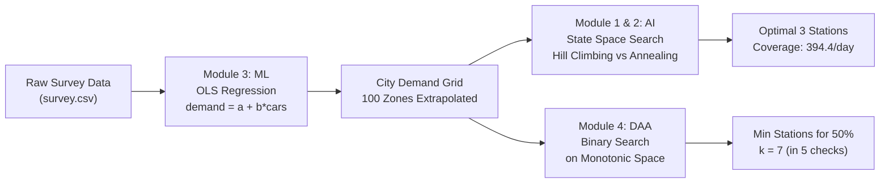

# ⚡ EV Charge Planner — AI/ML & DAA Academic Mini-Project

[](https://www.python.org/)
[-brightgreen.svg)]()
[]()

> **Project Objective:** Determine the optimal spatial placement of $K = 3$ electric-vehicle (EV) charging stations across a $10 \times 10$ city grid (100 zones) to maximize daily charging demand served, combining **Supervised Regression**, **Heuristic State-Space Optimization**, and **Monotonic Binary Search**.

---

## 📌 Quick Links
- 🗣️ **[Project Presentation & Demo Script (PRESENTATION_SCRIPT.md)](PRESENTATION_SCRIPT.md)** — Word-for-word 1-min, 3-min, and 5-min demo scripts for project presentation.

---

## 🏛️ Course Syllabus & Module Alignment



| Step | Academic Course Module | Topic Applied | Implementation in Project |
| :---: | :--- | :--- | :--- |
| **1** | **Module 3: Machine Learning** | Supervised Regression & Evaluation | Preprocessed missing data. Implemented closed-form **Ordinary Least Squares (OLS)** linear regression ($\text{demand} = a + b \cdot \text{cars}$) with **Mean Absolute Error (MAE)** evaluation. |
| **2** | **Module 1: AI State Space** | Problem Formulation | Defined formal 4-tuple $(S, S_0, T, f)$: State = 3 station coordinates; Transition = 1-step cardinal shift; Objective = Submodular set-union demand. |
| **3** | **Module 2: Heuristic Optimization** | Local Search vs Stochastic Annealing | Compared **Steepest-Ascent Hill Climbing** (susceptible to local maxima clumping) with **Simulated Annealing** (Metropolis criterion $P = e^{\Delta/T}$). |
| **4** | **DAA (Divide & Conquer)** | Binary Search on Answer Space | Proved monotonicity of coverage function $C(k)$ to find minimum stations for target threshold in **$O(\log N)$** iterations instead of $O(N)$ linear checks. |

---

## 🔬 Mathematical Formulations (First Principles)

No black-box third-party libraries (`scikit-learn`, `numpy`, or `pandas`) are used. All algorithms are coded from fundamental mathematical formulations:

### 1. Ordinary Least Squares (OLS) Linear Regression
$$\text{demand} = \beta_0 + \beta_1 \cdot \text{cars}$$
$$\beta_1 = \frac{\sum_{i=1}^n (x_i - \bar{x})(y_i - \bar{y})}{\sum_{i=1}^n (x_i - \bar{x})^2}, \qquad \beta_0 = \bar{y} - \beta_1 \bar{x}$$
- **Learned Model:** $\text{demand} = 3.29 + 0.41 \times \text{cars}$
- **Validation:** $\text{MAE} = 0.98$ charging sessions/day on unseen test samples.

### 2. Maximum Coverage Objective Function (NP-Hard)
$$\max_{S \subseteq V, \, |S|=3} \quad f(S) = \sum_{z \in \bigcup_{s \in S} N(s)} D(z)$$
- $N(s)$ is the von Neumann neighborhood of radius 1 (station + North, South, East, West neighbors).
- Overlapping coverage counts once (set union), introducing non-linear submodularity.

### 3. Metropolis Acceptance Criterion (Simulated Annealing)
$$P(\text{accept } s') = \begin{cases} 1 & \text{if } \Delta E > 0 \\ \exp\left(\frac{\Delta E}{T}\right) & \text{if } \Delta E \le 0 \end{cases}, \qquad T_{t+1} = \alpha T_t \quad (\alpha = 0.9993)$$
Downhill moves are permitted at high temperatures, allowing the algorithm to escape local maxima traps.

### 4. DAA Monotonic Predicate for Binary Search
- Because adding stations can never decrease coverage ($C(k+1) \ge C(k)$), the predicate $P(k) = [C(k) \ge \text{Target}]$ is sorted:
  $$[\text{False}, \text{False}, \dots, \text{False}, \text{True}, \text{True}, \dots, \text{True}]$$
- Binary search on range $[1, 20]$ determines the exact threshold in $\lceil \log_2(21) \rceil = \mathbf{5 \text{ checks}}$, compared to 20 linear checks ($O(\log N)$ vs $O(N)$).

---

## 📊 Experimental Results (10 Runs Benchmark)

| Algorithm | Mean Score | Worst Score | Best Score | Optimal Hit Rate | Time Complexity |
| :--- | :---: | :---: | :---: | :---: | :---: |
| **Hill Climbing** | 354.6 | 291.7 | 394.4 | **4 / 10 (40%)** | $O(\text{steps} \cdot K)$ |
| **Simulated Annealing** | **392.3** | **373.0** | **394.4** | **9 / 10 (90%)** | $O(\text{steps} \cdot K)$ |
| **Brute Force (Oracle)** | 394.4 | 394.4 | 394.4 | 10 / 10 (100%) | $O(\binom{N}{K} \cdot K) = 161,700$ evals |

### Why Hill Climbing Gets Stuck:
Hill climbing often places two stations near the same high-density hotspot. Moving one station out toward the third hotspot requires passing through low-demand valleys (negative $\Delta E$), which greedy search refuses to do. Simulated Annealing accepts those temporary drops early on and reliably reaches the global optimum:

```
Optimal Placement: [(2, 2), (2, 8), (7, 6)] -> 394.4 sessions/day (29.5% of city)
    . . . . . . . . . .
    . . # . . . . . # .
    . # S # . . . # S #        S = station (⚡)
    . . # . . . . . # .        # = zone covered
    . . . . . . . . . .        . = not covered
    . . . . . . . . . .
    . . . . . . # . . .
    . . . . . # S # . .
    . . . . . . # . . .
    . . . . . . . . . .
```

---

## 🚀 How to Run the Project

### Requirements
- **Python 3.8+** (Uses standard library: `csv`, `math`, `random`, `itertools`, `http.server`).
- **No external pip packages needed!**

### 1. Interactive Web Dashboard (Recommended for Faculty Demo)
```bash
python app.py
```
Open your browser at **http://localhost:8000**.
- Features an interactive city map with color gradient.
- Live comparison between Hill Climbing and Simulated Annealing.
- Built-in **"🎓 Faculty / Viva Guide"** button displaying syllabus mappings and formulas.
- Interactive slider for DAA Binary Search.

### 2. Terminal Mode
```bash
python main.py
```
Executes the full pipeline and prints a structured academic report with ASCII maps and iteration traces.

---

## 📁 Repository Structure

| File | Description |
| :--- | :--- |
| **[`main.py`](main.py)** | Core algorithmic implementation (OLS Regression, State Space, Annealing, Binary Search). |
| **[`app.py`](app.py)** | Built-in HTTP REST server connecting Python algorithms to the web interface. |
| **[`index.html`](index.html)** | Interactive frontend dashboard with map and live simulation. |
| **[`PRESENTATION_SCRIPT.md`](PRESENTATION_SCRIPT.md)** | 1-min, 3-min, and 5-min spoken scripts for project presentation. |
| **[`survey.csv`](survey.csv)** | Raw empirical survey data (registered EVs and measured charging demand for 25 zones). |
| **[`city.csv`](city.csv)** | City-wide EV density across all 100 spatial grid zones. |
| **[`run_output.txt`](run_output.txt)** | Verifiable execution log from `python main.py`. |
